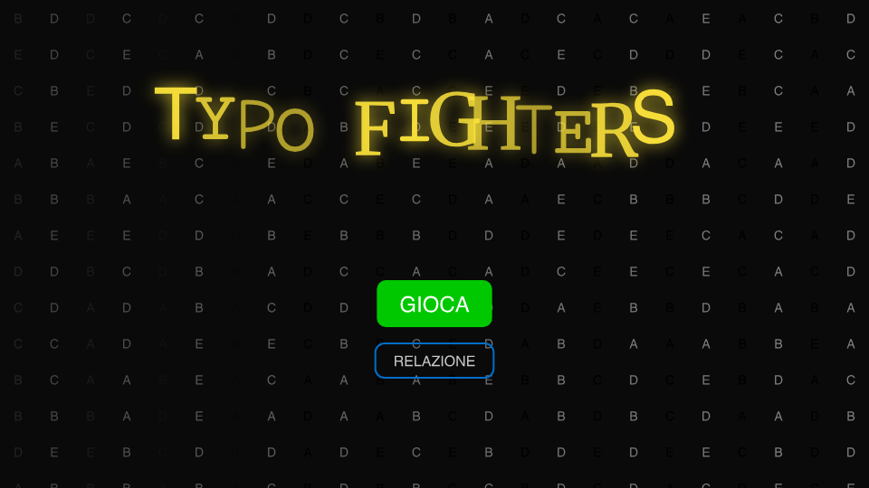
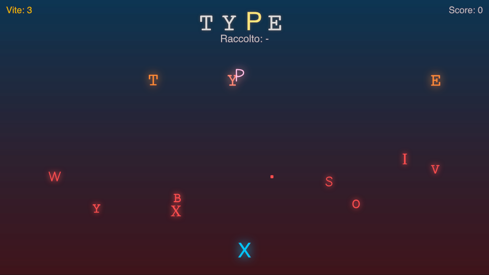

# 🎮 Relazione del Progetto — *Typo Fighters*

## 📌 Introduzione
*Typo Fighters* è un videogioco sviluppato in **p5.js** come esercizio di tipografia interattiva.  
L’obiettivo è esplorare la relazione tra **lettera, suono e interazione**, utilizzando il videogioco come mezzo espressivo.  

Il progetto si inserisce nel contesto della sperimentazione grafica e multimediale, con l’intento di unire tre aspetti principali:
- la **tipografia**, trattata come elemento dinamico e non statico;  
- il **suono sintetico**, che rafforza la dimensione interattiva;  
- il **gameplay**, che rende la sperimentazione accessibile e coinvolgente.  

---

## 🕹️ Gameplay
- Il giocatore controlla una lettera (inizialmente **X**).  
- **Controlli di movimento**: tramite i tasti **A/D** o le **frecce direzionali**.  
- **Attacco**: con la **barra spaziatrice**, il giocatore può sparare per colpire le lettere.  
- **Sistema delle vite**:
  - **X → vita piena**  
  - **Y → seconda vita**  
  - **Z → ultima possibilità**  
- Quando le vite si esauriscono, la partita termina.  

L’obiettivo è colpire nell’ordine corretto le lettere della **parola target**, finché non viene completata.  

---

## 🎨 Scelte grafiche
- Ogni **parola target** utilizza un **font specifico**, scelto in coerenza con il significato.  
- Una lettera alla volta subisce un effetto di *glitch temporaneo*, che ne altera forma e stile, introducendo instabilità visiva.  
- Le lettere in caduta non sono perfettamente allineate, aumentando la sensazione di movimento e caos.  
- L’interfaccia è volutamente minimale:
  - Parola target **grande e centrata** in alto.  
  - Parola raccolta mostrata subito sotto ed evidenziata.  
  - Vite rappresentate con i simboli tipografici **X/Y/Z**.  

---

## 🔊 Componente sonora
- Ogni lettera genera un **suono sintetico** tramite **p5.sound**.  
- La frequenza del suono varia in base al **codice ASCII** della lettera.  
- Gli effetti diventano progressivamente più **intensi** man mano che la partita avanza, contribuendo a costruire tensione e ritmo.  
- Eventi specifici sono accompagnati da feedback sonori dedicati:
  - **colpo riuscito**,  
  - **danno subito**,  
  - **vittoria** (trionfo sonoro crescente),  
  - **sconfitta** (caduta sonora discendente).  

---

## ⚙️ Implementazione tecnica
- Il gioco è organizzato in **classi**: `Player`, `Enemy`, `Bullet`, `Explosion`, `FallingLetter`, ecc., garantendo modularità e chiarezza.  
- Gli effetti di **glitch visivo** sono ottenuti tramite:
  - cambio casuale del font,  
  - traslazioni con `sin()` e `random()`.  
- I **suoni sintetici** sono generati con `p5.Oscillator` e `p5.Noise`, senza ricorrere esclusivamente a file audio esterni.  
- Il sistema delle vite è gestito tramite la funzione `updatePlayerSymbol()`, che cambia dinamicamente la lettera del giocatore in **X/Y/Z**.  
- Sono presenti schermate distinte:
  - **Menu iniziale**,  
  - **Schermata di vittoria**,  
  - **Game Over**,  
  tutte caratterizzate da animazioni tipografiche e variazioni di font.  
- La grafica utilizza **ombre e colori dinamici**, creando un forte contrasto visivo e rinforzando la leggibilità.  

---

## 🎯 Conclusioni
Il progetto ha permesso di esplorare come la **tipografia possa diventare interattiva**, andando oltre la funzione puramente comunicativa per assumere un ruolo attivo nel gameplay.  

Durante lo sviluppo sono emerse alcune sfide:
- bilanciamento tra difficoltà e giocabilità,  
- gestione delle prestazioni con molte lettere a schermo,  
- sincronizzazione tra effetti visivi e sonori.  

In prospettiva, possibili sviluppi futuri includono:
- l’introduzione di livelli progressivi,  
- la creazione di parole personalizzabili,  
- modalità multiplayer o collaborativa.  

---

## ✅ Sintesi
*Typo Fighters* integra tipografia, suono e gioco in un’unica esperienza interattiva.  
La lettera diventa personaggio, proiettile e interfaccia allo stesso tempo, mostrando come la grafica tipografica possa trasformarsi in linguaggio ludico ed espressivo.
